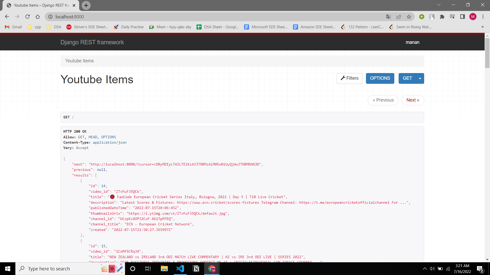
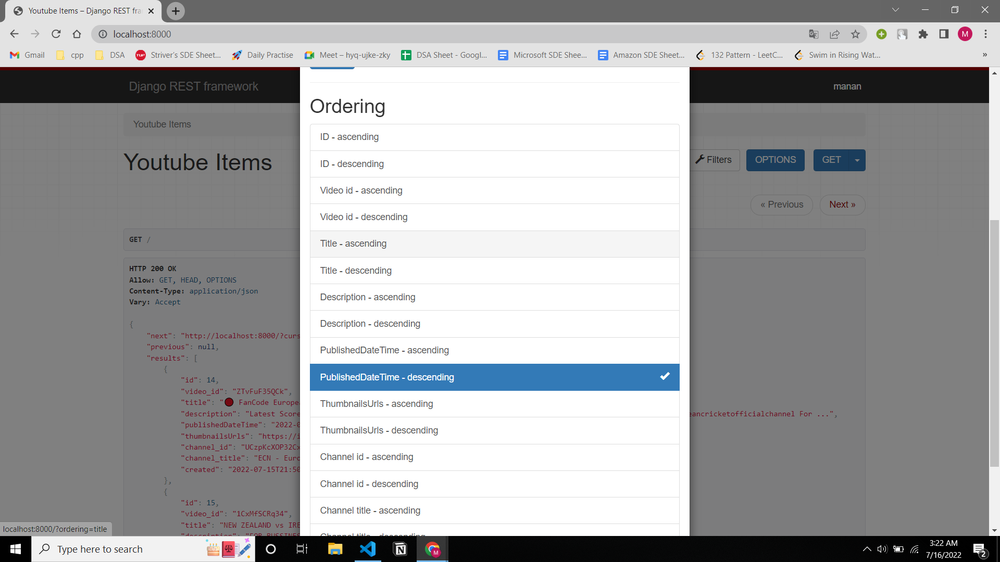
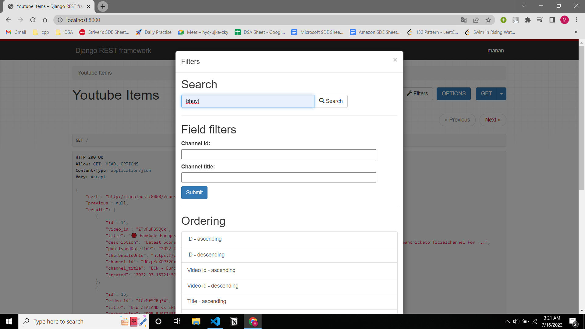
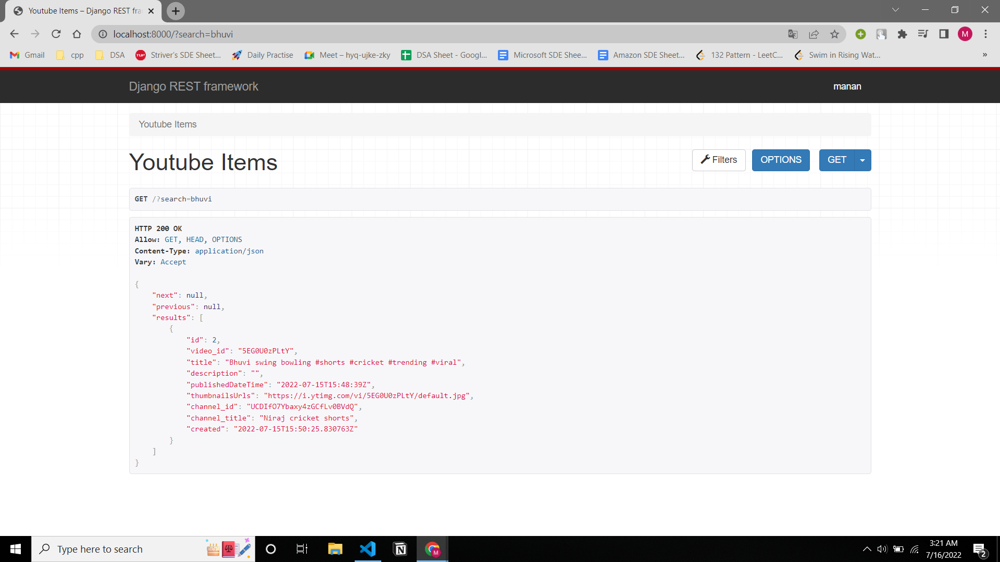

# youtube-api

This repository contains an API to fetch latest videos for search query cricket sorted in reverse chronological order of their publishing date-time from YouTube for a given tag/search query in a paginated response.

Server calls the YouTube API continuously in background with a interval of 1 minute for fetching the latest videos for a predefined search query stores the data of videos (specifically these fields - Video title, description, publishing datetime, thumbnails URLs and any other fields you require) in a database with proper indexes.
**(Cron Jobs is used to fetch videos after every 1 minute using Youtube Data Api and save it to the db)**

**It has support for supplying multiple API keys so that if quota is exhausted on one, it automatically uses the next available key.**

## How to use

### On local system
1. Clone the project
2. As this project is based on Django, your system need to have proper python setup, refer [this](https://www.python.org/downloads/)
3. Go the project through the terminal and install all dependencies by using typing `pip install -r requirements.txt` in the terminal
4. Inside the env file, fill the variable GOOGLE_API_KEYS with all the API Keys available,the list should be filled as 

`API_KEY_1, API_KEY_2, ...`

5. For getting an API key follow [this](https://developers.google.com/youtube/v3/getting-started)

6. Run the crons using `python manage.py runcrons`

7. Run the server using `python manage.py runserver`

### Using Docker
1. Clone the project

2. Run `sudo docker build -t youtube-api:v0 .`

3. Run `sudo docker run youtube-api:v0 sh -c "python manage.py makemigrations && python manage.py migrate && python manage.py runcrons"`

4. Run `sudo docker run -p 5000:5000 youtube-api:v0`

## Dashboard
For visualization through a dashboard one may directly run the app locally and the get the UI provided through django-rest-framework

### Filters

### Search

### Search Results

### Cron Jobs

